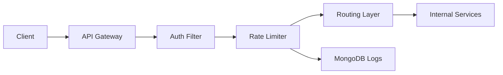

# 🚀 Rate Limiter + API Gateway

A **production-style API Gateway Service** built using **Java, Spring Boot, and MongoDB**, featuring **rate limiting, authentication, request routing, and monitoring**.

This project goes beyond CRUD and demonstrates how backend infrastructure components are designed in real-world systems.

---

## 📌 Project Overview

This API Gateway acts as a **central entry point** for all backend services and provides:

* 🔀 Request routing to internal services
* 🔐 Token-based authentication (JWT)
* ⏱️ Rate limiting (per user/IP)
* 📊 Logging & monitoring of API traffic

---

## 🧱 Tech Stack

* **Backend:** Java, Spring Boot
* **Security:** JWT Authentication
* **Database:** MongoDB
* **Build Tool:** Maven
* **Deployment:** (Render / Railway / AWS EC2 — update accordingly)

---

## ⚙️ Features

### 1. API Gateway Layer

* Centralized request handling
* Built using **Spring Filters / Interceptors**
* Routes requests to internal services

---

### 2. Rate Limiting

* Implemented using **Token Bucket Algorithm**
* Configurable limits (e.g., 100 requests/minute)
* Supports:

    * Per-user limiting
    * Per-IP limiting
* Returns:

  ```http
  429 Too Many Requests
  ```

---

### 3. Authentication

* JWT-based authentication
* Secures all endpoints
* Returns:

  ```http
  401 Unauthorized
  ```

---

### 4. Logging & Monitoring

Captures:

* Timestamp
* User/IP
* Endpoint accessed
* Response status
* Rate limit violations

Stored in:

* MongoDB collections

---

## 🏗️ Architecture



---

## 📂 Project Structure

```
api-gateway/
│
├── config/          # Security & Rate Limit configs
├── filter/          # Gateway filters (Auth, Logging)
├── security/        # JWT utilities
├── ratelimiter/     # Rate limiting logic
├── controller/      # Entry controllers
├── service/         # Business logic
├── repository/      # MongoDB repositories
└── model/           # Data models
```

---

## 🔑 Environment Variables

Create a `.env` or set environment variables:

```env
MONGO_URI=your_mongodb_connection_string
JWT_SECRET=your_secret_key
RATE_LIMIT=100
RATE_LIMIT_WINDOW=60
```

❗ Do NOT commit `.env` files or secrets.

---

## 🚀 Setup Instructions

### 1. Clone the Repository

```bash
git clone https://github.com/your-username/api-gateway.git
cd api-gateway
```

### 2. Configure Environment Variables

Set env variables in your system or IDE.

---

### 3. Run the Application

```bash
mvn spring-boot:run
```

---

### 4. Access API

```
http://localhost:8080
```

---

## 🌐 Deployment

🔗 **Live API URL:**

```
https://your-deployment-url.com
```

---

## 📬 API Documentation

### 🔐 Authentication

#### Login / Generate Token

```http
POST /api/auth/login
```

**Response:**

```json
{
  "token": "jwt_token_here"
}
```

---

### 🔁 Sample Protected API

```http
GET /api/test
Authorization: Bearer <token>
```

---

### 🚫 Rate Limit Exceeded

```http
429 Too Many Requests
```

```json
{
  "error": "Rate limit exceeded"
}
```

---

## 🧠 Design Decisions & Trade-offs

### 🔸 Why Token Bucket?

* Allows burst traffic
* Better user experience than fixed window
* Smooth request flow

### 🔸 Alternatives Considered

| Algorithm      | Pros                  | Cons                  |
| -------------- | --------------------- | --------------------- |
| Fixed Window   | Simple                | Burst at window edges |
| Sliding Window | Accurate              | More memory & compute |
| Token Bucket   | Balanced & scalable ✅ | Slight complexity     |

---

### 🔸 Scalability Considerations

* Stateless authentication (JWT)
* Rate limit can be moved to:

    * Redis (for distributed systems)
* MongoDB optimized with indexing

---

### 🔸 High Traffic Behavior

* Requests throttled via rate limiter
* System avoids overload by rejecting excess traffic
* Logs help analyze traffic spikes

---

### 🔸 Distributed System Strategy

* Use **Redis** for shared rate limiting
* Use **API Gateway clustering**
* Centralized logging system (ELK stack)

---

## 📊 Monitoring Strategy

* Logs stored in MongoDB
* Can integrate with:

    * Prometheus
    * Grafana
    * ELK Stack

---

## 🧪 Testing

Use:

* Postman
* Swagger (if integrated)

Test scenarios:

* Valid token request ✅
* Invalid token ❌
* Rate limit exceeded 🚫
* Unauthorized access 🔒

---

## ✅ Submission Checklist

* ✔️ Public GitHub repo
* ✔️ Clean code structure
* ✔️ README complete
* ✔️ APIs deployed & working
* ✔️ No secrets exposed
* ✔️ Core features implemented

---

## 👨‍💻 Author

**Soumyajit Nandi**

